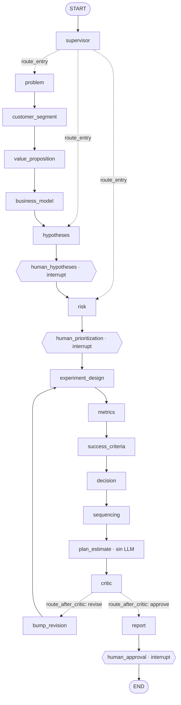
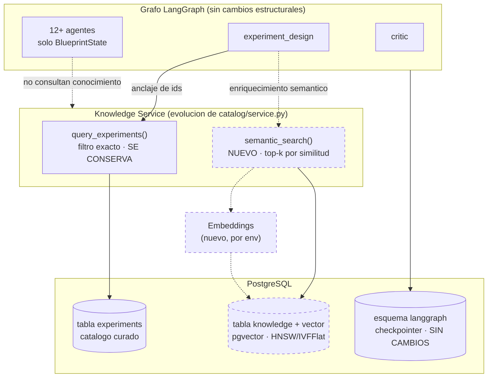

# Auditoría Técnica de Arquitectura — Backend Leanlang (Pre-RAG)

> **Rol:** Principal Software Architect / Staff Engineer / Auditor Técnico Senior
> **Alcance:** auditoría técnica del backend. **No** se implementó, refactorizó ni modificó código.
> **Fecha:** 2026-07-03
> **Repositorio auditado:** `C:\Users\NATALI\Leanlang\backend` — rama `main`
> **Objeto:** validar la solidez de la arquitectura actual y su preparación para evolucionar hacia
> una arquitectura híbrida con RAG + pgvector **sin rediseño estructural**.

## Convenciones de esta auditoría

Cada afirmación se etiqueta según su naturaleza epistémica:

- **[HECHO]** — comprobado directamente en el código (con evidencia `archivo:línea`).
- **[INFERENCIA]** — deducción razonada a partir de hechos; no verificable por ejecución en esta auditoría.
- **[RECOMENDACIÓN]** — sugerencia de mejora; no es un defecto bloqueante.

Clasificación de madurez por componente:

| Símbolo | Significado |
|:---:|---|
| 🟢 | Correcto — implementado adecuadamente, sin acción requerida |
| 🟡 | Mejorable — funciona, pero tiene deuda técnica o riesgo acotado |
| 🔴 | Requiere rediseño — defecto estructural |

> **Nota de método:** las afirmaciones sobre la topología del grafo, el estado, el checkpointer, la
> recuperación de conocimiento, los prompts y la observabilidad se basan en **lectura directa** de los
> archivos fuente. Lo que no puede demostrarse desde el código (p. ej. comportamiento bajo carga real,
> latencias, métricas de tokens en producción) se marca explícitamente como **[INFERENCIA]** o se
> declara no demostrable.

---

## 1. Resumen Ejecutivo

El backend es un **enjambre multiagente determinista** construido sobre LangGraph (`StateGraph`), FastAPI
y PostgreSQL, que transforma una idea de negocio en bruto en un *Validation Blueprint* siguiendo la
metodología del libro *Testing Business Ideas*. La arquitectura es **sólida, cohesiva y correctamente
implementada para su alcance actual**.

**Veredicto global: 🟢 Arquitectura sólida y preparada para evolución híbrida.**

- **[HECHO]** El flujo entre los 19 nodos es explícito, determinista y trazable; **no se detecta pérdida
  de contexto** en el camino feliz.
- **[HECHO]** Las alucinaciones se minimizan **por diseño en código**, no solo por prompt: el *Experiment
  Design Agent* descarta cualquier `experiment_id` fuera del catálogo permitido, y varios cálculos son
  deterministas sin LLM.
- **[HECHO]** Existe persistencia real (checkpointer PostgreSQL con esquema aislado), recuperación tras
  interrupción (human-in-the-loop con `Command(resume=...)`) y observabilidad completa (LangSmith
  env-gated con metadata/tags/spans).
- **[INFERENCIA]** La arquitectura escala razonablemente **sin RAG** mientras la base de conocimiento
  permanezca acotada al catálogo curado de 44 experimentos.
- **[INFERENCIA]** La incorporación de RAG + pgvector sería una **evolución natural, no una corrección de
  errores**: el punto de extensión ya está aislado en un único servicio (`app/catalog/service.py`).

### Tabla semáforo por componente

| # | Componente | Estado | Síntesis |
|:--:|---|:--:|---|
| 1 | Arquitectura general / capas | 🟢 | Separación de responsabilidades limpia; motor LLM agnóstico |
| 2 | BlueprintState (estado compartido) | 🟢🟡 | Correcto; `messages` crece sin cota |
| 3 | Flujo entre agentes | 🟢 | Determinista, sin pérdida de contexto |
| 4 | Checkpoint y recuperación | 🟢🟡 | Correcto; saver síncrono + doble fuente de verdad |
| 5 | Recuperación de conocimiento | 🟡 | Determinista pero es filtro **JSON en memoria**, no SQL ni semántico |
| 6 | Prompts / anti-alucinación | 🟢🟡 | Grounding duro en código; cláusulas anti-invención parciales |
| 7 | Salida estructurada (Pydantic) | 🟢 | `function_calling` + retry + validadores defensivos |
| 8 | Observabilidad (LangSmith) | 🟢 | Reconstrucción completa de ejecuciones posible |
| 9 | Escalabilidad | 🟢🟡 | Escala por proyecto; el conocimiento por búsqueda exacta no escala |
| 10 | Preparación para RAG | 🟢 | Extensión aislada; no requiere rediseño |

### Salvedades clave (deben constar)

1. **[HECHO]** La "recuperación determinista desde PostgreSQL" descrita en auditorías previas es, en
   realidad, **filtrado de un JSON en memoria** (`app/catalog/service.py`). La tabla `experiments` existe
   pero **ningún agente la consulta en runtime**.
2. **[HECHO]** El checkpointer usa `PostgresSaver` **síncrono** dentro de una app async con SSE.
3. **[HECHO]** Hay **doble fuente de verdad** del estado: el checkpointer (`langgraph.*`) y el snapshot
   JSONB en la tabla `blueprints`.
4. **[HECHO]** El docstring de `app/graph/build_graph.py` está **desactualizado** respecto al grafo real.

Ninguna salvedad exige rediseño estructural.

---

## 2. Arquitectura Detectada

### 2.1 Organización por capas — 🟢

**[HECHO]** El proyecto separa responsabilidades de forma clara:

| Capa | Ubicación | Responsabilidad |
|---|---|---|
| Nodos / agentes | `app/agents/` | 14 agentes LLM + supervisor + nodos HITL + prompts |
| Topología y runtime | `app/graph/` | `build_graph.py` (topología), `runtime.py` (checkpointer), `studio.py` |
| Núcleo transversal | `app/core/` | `config.py`, `llm.py` (factoría agnóstica), `observability.py` |
| Persistencia | `app/db/` | `models.py` (ORM), `session.py` (engine/pool) |
| Esquemas | `app/schemas/` | Estado + modelos Pydantic de salida estructurada + DTOs API |
| Conocimiento | `app/catalog/` | `service.py` (consulta), `seed.py`, `experiments.json` (44 ítems) |
| API | `app/api/` | `routes/` (auth, projects, blueprint, export) + `streaming.py` (SSE) |
| Evaluación | `app/eval/` | `rubric.py`, `run_eval.py` (scoring determinista, sin LLM-judge) |

**[HECHO]** El motor LLM está **desacoplado y es agnóstico de proveedor** mediante
`init_chat_model` (`app/core/llm.py:29`), intercambiable por variable de entorno (anthropic / openai /
endpoints compatibles como DeepSeek/Groq/Together/Ollama). Esto favorece la comparación de modelos.

**[HECHO]** Acoplamiento bajo: los agentes no conocen la base de datos ni la observabilidad; la
metadata de LangSmith se inyecta explícitamente por `RunnableConfig` (`app/core/observability.py`), y la
recuperación de conocimiento pasa por un único servicio (`app/catalog/service.py`).

### 2.2 Topología real del grafo — 🟢

**[HECHO]** Definida en `app/graph/build_graph.py:45-117`. **19 nodos** sobre `StateGraph(BlueprintState)`,
con dos rutas condicionales (triaje de entrada y bucle del crítico) y tres `interrupt` human-in-the-loop.

**[HECHO]** Rutas condicionales:
- **Triaje de entrada** (`build_graph.py:76-80`, lógica en `app/agents/supervisor.py:23-33`): `route_entry`
  permite re-entrar saltando etapas ya cubiertas (`problem` → `hypotheses` → `risk`).
- **Bucle del crítico** (`build_graph.py:103-107`, lógica en `supervisor.py:37-42`): `route_after_critic`
  devuelve a `experiment_design` vía `bump_revision` si el crítico no aprueba, hasta `MAX_REVISIONS = 1`
  (`supervisor.py:14`).

**[HECHO] Discrepancia de documentación — 🟡:** el docstring de `build_graph.py:6-12` **no refleja** el
grafo real: omite el nodo `business_model` (hoy entre `value_proposition` y `hypotheses`) y la cadena
`decision → sequencing → plan_estimate` (hoy entre `success_criteria` y `critic`). Impacto: bajo
(cosmético/documental), pero induce a error a quien lea solo la cabecera.

### 2.3 Invocación y streaming — 🟢

**[HECHO]** El grafo se ejecuta desde `app/api/routes/blueprint.py`:
- `POST /projects/{id}/blueprint/run` (`blueprint.py:66-95`): crea la fila `Blueprint`, fija
  `thread_id = f"bp-{bp.id}"` y arranca `graph.stream(...)` vía SSE.
- `POST /blueprint/{id}/resume` (`blueprint.py:98-116`): reanuda un `interrupt` con
  `Command(resume=...)` (`blueprint.py:110-111`).
- `app/api/streaming.py:57` ejecuta `graph.stream(..., stream_mode="updates")` en un **worker thread**,
  empujando eventos a una `asyncio.Queue` y emitiendo SSE (`agent_update`/`interrupt`/`error`).

---

## 3. Hallazgos Positivos

Todos con evidencia directa **[HECHO]**:

1. **Grounding anti-alucinación en código (no solo prompt).** El *Experiment Design Agent* construye
   `allowed_ids` desde el catálogo y **descarta** toda recomendación cuyo `experiment_id` no pertenezca al
   conjunto permitido (`app/agents/experiment_design.py:100-107`); el *Sequencing Agent* filtra ids
   inventados del roadmap (`app/agents/sequencing.py:35-37`). Esto es una salvaguarda determinista, no una
   súplica al modelo.

2. **Cálculos deterministas sin LLM donde importa la exactitud.** `app/agents/plan_estimate.py` agrega
   coste/tiempo/capacidades desde el catálogo (descrito como "exactas y auditables, no alucinadas"); el
   ensamblado de *test cards* (`app/agents/success_criteria.py:23-44`) y el triaje/routing
   (`supervisor.py`) tampoco usan LLM.

3. **Salida estructurada robusta.** Los 13 nodos LLM usan
   `with_structured_output(schema, method="function_calling").with_retry(stop_after_attempt=3)`
   (`app/core/llm.py:37-50`), con validadores Pydantic que clampan escalas 1–5 y coercen enums
   (`app/schemas/experiment.py`, `hypothesis.py`, etc.). Temperatura global baja **0.2** para
   reproducibilidad (`app/core/config.py:15`).

4. **Persistencia y recuperación reales.** `PostgresSaver` con esquema aislado `langgraph` y `search_path`
   forzado (`app/graph/runtime.py:39-66`); recuperación tras interrupción verificable por diseño mediante
   `graph.get_state(...)` y `Command(resume=...)`.

5. **Observabilidad de grado producción.** LangSmith env-gated y desacoplada (`app/core/observability.py`):
   `run_name`, tags (`app_env`, `phase`, `project`, `blueprint`) y metadata (ids, provider, model,
   temperature, versión de prompt) inyectados por `RunnableConfig`. La única "tool" real
   (`catalog.query_experiments`) está instrumentada con `@traceable` (`app/catalog/service.py:37`).

6. **Anti-sesgo de confirmación explícito.** El *Hypotheses Agent* debe generar contra-hipótesis para las
   1–2 hipótesis más críticas (`app/agents/prompts/__init__.py:64-67`), y el *Decision Agent* pre-compromete
   reglas persevere/pivot/kill **antes** de ejecutar (Learning Cards).

7. **Aislamiento del punto de extensión de conocimiento.** Toda la recuperación pasa por
   `app/catalog/service.py` — condición ideal para introducir RAG sin tocar los agentes.

---

## 4. Hallazgos Técnicos (por área del alcance)

### 4.1 BlueprintState — 🟢 con matiz 🟡

- **[HECHO]** `TypedDict, total=False` (`app/schemas/state.py:9-47`); campos dicts/lists serializables para
  que el checkpointer los persista sin fricción. Cada agente valida con su schema Pydantic al entrar y
  serializa con `.model_dump()` al salir.
- **[HECHO]** **Único reducer:** `messages: Annotated[list, add_messages]` (línea 47). Todos los demás
  campos usan la semántica por defecto **last-write-wins** (sobrescritura).
- **[INFERENCIA]** No hay pérdida de artefactos: cada clave del estado es escrita por **un solo** agente
  (p. ej. `recommendations` solo por `experiment_design`), así que la sobrescritura no compite. La única
  reescritura intencionada es en el bucle del crítico, donde `experiment_design` recalcula
  `recommendations` con el feedback del crítico — comportamiento deseado.
- **[HECHO] Matiz de crecimiento (🟡):** `messages` **crece de forma monótona** (cada nodo añade un
  `trace()` vía `add_messages`), incluyendo las iteraciones del bucle del crítico. Impacto en consumo de
  contexto/almacenamiento por run. **Prioridad: media.**

**Qué agrega y consume cada agente:**

| Agente | Consume (lee del estado) | Produce (escribe) |
|---|---|---|
| problem | `raw_idea` | `problem` |
| customer_segment | `raw_idea`, `problem` | `customer_segment` |
| value_proposition | `raw_idea`, `problem`, `customer_segment` | `value_proposition` |
| business_model | `raw_idea`, `customer_segment`, `value_proposition` | `business_model` |
| hypotheses | los 4 anteriores + `raw_idea` | `hypotheses` |
| risk | `hypotheses` (2 llamadas) | `classifications`, `prioritization` |
| experiment_design | `prioritization`, `classifications`, `hypotheses`, `constraints`, catálogo, `critic_review.issues` | `recommendations` |
| metrics | `hypotheses`, `recommendations` | `metric_specs` |
| success_criteria | `hypotheses`, `recommendations`, `metric_specs` | `success_criteria`, `test_cards` |
| decision | `hypotheses`, `recommendations`, `success_criteria` | `decisions` |
| sequencing | `recommendations` (recortado), `constraints` | `validation_roadmap` |
| plan_estimate | `recommendations` + catálogo (sin LLM) | `plan_estimate` |
| critic | 11 campos del blueprint | `critic_review`, `revision_count` |
| report | blueprint completo (14 campos) | `report` |

- **[INFERENCIA]** El crecimiento del estado (excluyendo `messages`) está **acotado por proyecto**: es la
  suma de artefactos de tamaño finito. No crece con el número de proyectos ni con el tiempo.

### 4.2 Flujo entre agentes — 🟢

- **[HECHO]** Backbone lineal + 2 condicionales + 3 interrupts (§2.2). Cada nodo declara entrada (campos
  que lee), salida (campos que escribe) y dependencias implícitas por el orden de las aristas.
- **[INFERENCIA]** **No existe punto de pérdida de contexto en el flujo feliz**: cada agente recibe del
  estado exactamente los artefactos aguas arriba que necesita. El único lugar donde el contexto se "recorta"
  deliberadamente es el *Sequencing Agent*, que pasa `recommendations` con claves seleccionadas
  (`app/agents/sequencing.py:21-27`) — decisión de eficiencia, no pérdida.
- **[HECHO]** El feedback del crítico se propaga: `experiment_design` inyecta `critic_review.issues` en su
  prompt al re-ejecutar (`app/agents/experiment_design.py:76-81`), de modo que la corrección no se pierde.

### 4.3 Checkpoint y Recuperación — 🟢 con observaciones 🟡

- **[HECHO]** `PostgresSaver.from_conn_string(dsn)` con `saver.setup()` crea las tablas del checkpointer en
  el esquema `langgraph` (`app/graph/runtime.py:53-66`). `_with_search_path` (líneas 39-50) fuerza
  `options=-c search_path=langgraph` para aislar el esquema.
- **[HECHO]** Keying por `thread_id = f"bp-{bp.id}"` (`app/api/routes/blueprint.py:80`), enlazado a la
  columna `Blueprint.thread_id` (`app/db/models.py:55`).
- **[HECHO]** Recuperación tras interrupción: el resume usa `Command(resume=...)` con el mismo `thread_id`
  (`blueprint.py:110-115`); el estado final se relee con `graph.get_state(...)` y se marca
  `awaiting_input`/`done` según `snapshot.next` (`blueprint.py:39-55`).
- **[INFERENCIA]** El sistema **puede recuperarse correctamente tras una interrupción** (proceso caído o
  espera HITL) porque el estado vive en Postgres, no en memoria del proceso. No verificado por ejecución en
  esta auditoría, pero el diseño lo garantiza.

**Observaciones (🟡):**
- **[HECHO]** Saver **síncrono** `PostgresSaver` (no `AsyncPostgresSaver`) dentro de app async con SSE; el
  `graph.stream` corre en worker thread (`app/api/streaming.py:57`). Impacto: **[INFERENCIA]** posible
  límite de concurrencia bajo carga alta. **Prioridad: media.**
- **[HECHO]** **Doble fuente de verdad**: checkpointer (`langgraph.*`) + snapshot JSONB en `blueprints.state`
  (`blueprint.py:47-52`). `GET /blueprint/{id}` lee de `blueprints.state`, no del checkpointer. Riesgo de
  divergencia si una escritura falla. **Prioridad: media.**
- **[HECHO]** Fallback a memoria **silencioso** ante excepción (`runtime.py:64-66`, `main.py:34-37`): si
  Postgres no está disponible al arrancar, el grafo usa `MemorySaver` sin fallar el arranque → se pierde la
  persistencia sin alarma evidente. **Prioridad: media.**

### 4.4 Recuperación de Información (conocimiento) — 🟡 · **hallazgo central para RAG**

- **[HECHO] Corrige la premisa del encargo:** la recuperación determinista del catálogo de 44 experimentos
  **NO usa consultas SQL** en runtime. `app/catalog/service.py:19-22` carga `experiments.json` con
  `@lru_cache` y `query_experiments` (`service.py:37-68`) filtra/ordena **en Python puro**:
  - Filtros: `risk_type` ∈ `e.types`, `stage == e.category`, `cost ≤ max_cost`, `setup_time ≤ max_setup`,
    `evidence_strength ≥ min` (líneas 53-64).
  - Orden: `(-evidence_strength, cost, setup_time)` (línea 67) — regla del libro "barato/rápido primero,
    evidencia tan fuerte como se pueda".
- **[HECHO]** La tabla Postgres `experiments` (`app/db/models.py:64-88`) existe y se **siembra** desde el
  mismo JSON (`app/catalog/seed.py`), pero **ningún agente la consulta**: es un espejo, no la fuente de
  runtime.
- **[HECHO]** El único dato de la BD que entra a los prompts es `project.raw_idea` y `project.constraints`
  (`app/api/routes/blueprint.py:74,83-90`). El resto del contexto es artefacto generado por los agentes.

**Fortalezas:** determinismo total, reproducibilidad, auditabilidad (la selección es explicable), sin
dependencia de BD para funcionar (tests incluidos).
**Limitaciones:** búsqueda **estructurada por atributos exactos** (no semántica); acoplada a un catálogo
curado y **acotado a 44 ítems**; no generaliza a conocimiento no catalogado.
**Escalabilidad:** O(n) sobre lista — irrelevante a 44; se vuelve limitante **solo si el conocimiento
crece** (justo la motivación de RAG).

> **Diferencia con RAG (adelanto de §7):** el mecanismo actual responde "¿qué experimentos del catálogo
> cumplen estos filtros exactos?"; RAG respondería "¿qué conocimiento es **semánticamente similar** a esta
> hipótesis/contexto?", recuperando top-k por similitud vectorial (pgvector) sobre un corpus potencialmente
> ilimitado. Son complementarios, no sustitutos.

### 4.5 Prompts / Anti-alucinación — 🟢 con gaps 🟡

- **[HECHO]** Todos los system prompts viven centralizados y versionados en
  `app/agents/prompts/__init__.py` (versiones líneas 4-17; p. ej. `problem_agent_v1`). Cada mensaje `trace()`
  propaga la versión del prompt al stream (`app/agents/base.py:10-13`) — trazabilidad de prompt por
  ejecución.
- **[HECHO]** Consistencia alta: mismo estilo, mismo idioma (español), reglas del libro embebidas por
  agente. Restricciones anti-invención explícitas: "NUNCA inventes experimentos ni ids"
  (`prompts/__init__.py:104-105`), "deja la lista vacía en vez de alucinar" (líneas 29, 179), "usa los
  experiment_id reales (no inventes)" (línea 201).
- **[HECHO] Gaps (🟡):** solo **2 de 14** agentes tienen cláusula "no inventar" en su prompt; **no existe**
  ninguna instrucción tipo "cita fuentes" o "di 'no sé' si falta contexto". La defensa real recae en el
  **grounding en código** (§3.1), que es más fiable que el prompt — pero conviene documentarlo como decisión
  consciente. **Prioridad: baja.**
- **[HECHO]** `MAX_REVISIONS = 1` (`supervisor.py:14`): el crítico solo puede forzar **una** corrección.
  **[INFERENCIA]** Puede ser agresivo si un diseño necesita 2+ iteraciones. **Prioridad: baja.**

### 4.6 Consumo de Contexto — 🟢 con matiz 🟡

- **[INFERENCIA]** El contexto por llamada LLM está **acotado**: cada nodo inyecta solo los artefactos aguas
  arriba relevantes (§4.1), no el estado completo. El *Report Agent* y el *Critic* son los que más
  consumen (14 y 11 campos), pero siguen siendo de tamaño finito por proyecto.
- **[HECHO]** `messages` crece sin cota (§4.1) — pero **no** se reinyecta a los prompts de los agentes (los
  prompts usan `jdump` de artefactos concretos, no el historial de mensajes). Por tanto el crecimiento de
  `messages` afecta **almacenamiento y payload de streaming**, no el tamaño del prompt de cada agente.
- **[INFERENCIA]** El consumo de tokens **no escala con el número de proyectos** (cada run es independiente
  por `thread_id`); escala con la longitud de un blueprint individual, que es acotada.
- **No demostrable desde el código:** cifras reales de tokens/costo por run — requerirían inspección de
  LangSmith en producción.

### 4.7 Observabilidad — 🟢

- **[HECHO]** `tracing_enabled()` exige `langsmith_tracing AND api_key` (`observability.py:24-26`).
  `build_run_config` (líneas 51-114) produce `run_name`, tags y metadata ricos, pasados **explícitamente**
  por config para cruzar el worker thread (no depende de contextvars). LangGraph aporta spans por nodo
  automáticamente (nombre del nodo).
- **[INFERENCIA]** Es posible **reconstruir completamente una ejecución** (grafo, nodos, llamadas LLM,
  tool `catalog.query_experiments`, versión de prompt, ids de proyecto/blueprint/usuario).
- **[HECHO] Gap menor (🟡):** las variables `LANGSMITH_*` no están documentadas en `.env.example`.
  **Prioridad: baja.**

---

## 5. Riesgos

| # | Riesgo | Tipo | Impacto | Prob. | Prioridad | Evidencia |
|:--:|---|:--:|---|:--:|:--:|---|
| R1 | Saver síncrono en app async → posible cuello bajo concurrencia | [HECHO]+[INF] | Medio | Media | Media | `runtime.py:57`, `streaming.py:57` |
| R2 | Doble fuente de verdad del estado (checkpointer vs `blueprints.state`) → divergencia | [HECHO] | Medio | Baja | Media | `blueprint.py:39-55` |
| R3 | `messages` crece sin cota → payload/almacenamiento por run | [HECHO] | Bajo-Medio | Alta | Media | `state.py:47` |
| R4 | Fallback a memoria silencioso → pérdida de persistencia sin alarma | [HECHO] | Alto (si ocurre) | Baja | Media | `runtime.py:64-66`, `main.py:34-37` |
| R5 | `MAX_REVISIONS=1` → una sola corrección del crítico | [HECHO]+[INF] | Bajo | Media | Baja | `supervisor.py:14` |
| R6 | Docstring del grafo desactualizado → error de lectura | [HECHO] | Bajo | — | Baja | `build_graph.py:6-12` |
| R7 | Cláusulas anti-invención parciales en prompts | [HECHO] | Bajo | — | Baja | `prompts/__init__.py` |
| R8 | Conocimiento limitado a 44 ítems por búsqueda exacta | [HECHO] | Medio (a futuro) | — | Media | `catalog/service.py` |

**[INFERENCIA]** Ninguno de estos riesgos es estructural ni bloqueante; R1, R2 y R4 son los más relevantes
para operación en producción; R8 es precisamente el que motiva la evolución a RAG.

---

## 6. Evaluación de Escalabilidad

**Metodología:** distinguir dos ejes independientes — (a) **número de proyectos/ejecuciones** y (b)
**tamaño de la base de conocimiento**. El sistema escala muy distinto en cada uno.

### Eje A — número de proyectos: 🟢

| Escenario | Comportamiento esperado |
|---|---|
| **1.000 proyectos** | Sin problema. Cada run es independiente por `thread_id`; Postgres con índices en FKs y `thread_id` (`db/models.py:31,52,55`). |
| **10.000 proyectos** | Sin problema estructural. **[INFERENCIA]** posible presión en la tabla `blueprints` (JSONB) y en las tablas del checkpointer; se mitiga con housekeeping/particionado. |
| **100.000 proyectos** | Escala horizontalmente (stateless por `thread_id`). Cuellos operativos, no arquitectónicos: pool de conexiones (`session.py`: `pool_size=5, max_overflow=10`), saver síncrono (R1), y crecimiento de almacenamiento por `messages` (R3) + doble snapshot (R2). |

**[HECHO]** Componentes que escalan bien: catálogo O(44) trivial y cacheado (`@lru_cache`); `get_model`
cacheado; ejecución sin estado compartido entre proyectos.

**[INFERENCIA]** Cuellos a vigilar con volumen: (1) saver síncrono (R1); (2) pool de conexiones por defecto
pequeño; (3) almacenamiento acumulado por `messages` y doble fuente de verdad.

### Eje B — tamaño del conocimiento: 🟡

**[HECHO/INFERENCIA]** Mientras el conocimiento sea el catálogo curado de 44 experimentos, la búsqueda O(n)
en memoria es óptima. **Si se quiere ampliar** el conocimiento (más experimentos, guías, casos, corpus del
libro completo, aprendizajes de proyectos previos), la búsqueda por **atributos exactos** deja de ser
suficiente: no captura similitud semántica ni escala a miles de documentos con relevancia. **Este es el
límite real que RAG resuelve** — y es una necesidad de producto, no un defecto de implementación.

---

## 7. Preparación para una Arquitectura Híbrida (RAG + pgvector)

**[INFERENCIA] Tesis central:** la arquitectura está preparada para incorporar RAG como **evolución
natural**, porque toda la recuperación de conocimiento ya está aislada tras un único servicio
(`app/catalog/service.py` — la única "tool" del sistema). Introducir RAG significa **añadir un método de
recuperación semántica** a ese servicio, sin tocar el estado, el checkpointer, la observabilidad ni la
mayoría de los agentes.

### 7.1 Qué debería permanecer EXACTAMENTE igual — 🟢

- **BlueprintState** y el patrón de artefactos serializables (`app/schemas/state.py`).
- **Checkpointer / persistencia / recuperación** (`app/graph/runtime.py`) — RAG es ortogonal al estado.
- **Observabilidad LangSmith** (`app/core/observability.py`) — el nuevo *retriever* se instrumenta igual con
  `@traceable`.
- **Salida estructurada Pydantic** y la factoría LLM agnóstica (`app/core/llm.py`).
- **Topología del grafo** (`app/graph/build_graph.py`) — no requiere nodos nuevos para el caso base.

### 7.2 Qué debería integrarse con un futuro *Knowledge Service*

- **`app/catalog/service.py`**: hoy expone `query_experiments` (filtro exacto). Evolucionaría a un
  *Knowledge Service* con **dos modos**: (1) `query_experiments` (exacto, se conserva) y (2)
  `semantic_search(query, top_k)` (nuevo, sobre pgvector). El *Experiment Design Agent* seguiría usando el
  primero para anclar ids del catálogo y podría usar el segundo para enriquecer con conocimiento no
  catalogado.
- **Capa de datos**: nueva tabla con columna `vector` (pgvector) e índice HNSW/IVFFlat; embeddings del
  catálogo + corpus adicional. **No** sustituye a `experiments`; la complementa.
- **Config** (`app/core/config.py`): añadir proveedor/modelo de embeddings y parámetros de recuperación.

### 7.3 Qué agentes REALMENTE necesitarían RAG

| Agente | ¿Necesita RAG? | Justificación |
|---|:--:|---|
| **experiment_design** | ✅ Sí | Es el consumidor de conocimiento; recuperación semántica mejoraría la selección/diseño más allá de los 44 ítems. |
| *(futuro) knowledge/coach* | ✅ Opcional | Un agente nuevo que responda con conocimiento del corpus del libro se beneficiaría de RAG. |
| problem, customer_segment, value_proposition, business_model, hypotheses, risk, metrics, success_criteria, decision, sequencing, plan_estimate, critic, report | ❌ No | Operan sobre artefactos del propio `BlueprintState`; su entrada es el contexto ya generado, no conocimiento externo a recuperar. |

**[INFERENCIA]** Es decir, **1 de 14 agentes** (más, opcionalmente, uno nuevo) tocaría RAG. El resto sigue
funcionando **solo con BlueprintState** — prueba de que RAG es una extensión localizada, no un rediseño.

### 7.4 Arquitectura híbrida recomendada

Los elementos punteados son las **únicas adiciones**; todo lo sólido permanece igual.

### 7.5 Diferencia mecanismo actual vs RAG

| Dimensión | Actual (catálogo) | RAG (pgvector) |
|---|---|---|
| Tipo de búsqueda | Filtro por atributos exactos | Similitud semántica (top-k) |
| Fuente | `experiments.json` en memoria | Corpus vectorizado en Postgres |
| Tamaño | Acotado (44) | Potencialmente ilimitado |
| Determinismo | Total | Aproximado (ranking por similitud) |
| Explicabilidad | Alta (reglas explícitas) | Media (distancia vectorial) |
| Cuándo se justifica | Catálogo curado y pequeño | Conocimiento amplio y no catalogado |

---

## 8. Recomendaciones Priorizadas

Todas **[RECOMENDACIÓN]**, ninguna bloqueante ni de rediseño.

**P0 — higiene inmediata (bajo esfuerzo, alto retorno de claridad):**
1. Actualizar el docstring de `app/graph/build_graph.py:6-12` para reflejar el grafo real (R6).
2. Documentar las variables `LANGSMITH_*` en `.env.example` (§4.7).
3. Convertir el fallback silencioso a memoria en un **warning explícito**/health-check degradado (R4).

**P1 — robustez operativa (antes de escalar en producción):**
4. Acotar/podar `messages` (p. ej. límite o resumen periódico) para contener el crecimiento por run (R3).
5. Unificar o clarificar la fuente de verdad del estado (checkpointer vs `blueprints.state`) y su
   consistencia transaccional (R2).
6. Evaluar migrar a `AsyncPostgresSaver` y dimensionar el pool de conexiones para concurrencia alta (R1).

**P2 — calidad de dominio (opcional):**
7. Extender las cláusulas anti-invención a los agentes que hoy no las tienen, documentando que la defensa
   principal es el grounding en código (R7).
8. Revisar `MAX_REVISIONS=1` según datos reales de calidad del crítico (R5).

**Evolución (cuando el producto lo requiera):**
9. Introducir RAG + pgvector como se describe en §7 — extensión de `catalog/service.py`, sin rediseño.

---

## 9. Veredicto Final

**Respuesta explícita a las 7 preguntas del objetivo:**

| # | Pregunta | Veredicto | Base |
|:--:|---|:--:|---|
| 1 | ¿La arquitectura actual está correctamente implementada? | 🟢 **Sí** | Capas cohesivas, motor agnóstico, grafo determinista (§2, §3) |
| 2 | ¿El flujo entre agentes es consistente? | 🟢 **Sí** | Encadenamiento explícito y trazable (§4.2) |
| 3 | ¿Existe pérdida de contexto? | 🟢 **No** (en flujo feliz) | Cada clave escrita por un agente; feedback del crítico se propaga (§4.1-4.2) |
| 4 | ¿El mecanismo evita razonablemente las alucinaciones? | 🟢 **Sí** | Grounding en código + cálculos deterministas + crítico (§3, §4.5) |
| 5 | ¿Escala correctamente sin RAG? | 🟢🟡 **Sí, por proyecto; limitado por conocimiento** | §6 (eje A 🟢 / eje B 🟡) |
| 6 | ¿Qué limitaciones reales tiene? | 🟡 | Conocimiento acotado (44, búsqueda exacta), saver síncrono, doble fuente de verdad, `messages` sin cota (§4.4, §5) |
| 7 | ¿RAG + pgvector sería evolución natural (no corrección)? | 🟢 **Sí** | Punto de extensión aislado; 1/14 agentes afectado; resto intacto (§7) |

### Conclusión

La arquitectura del backend es **sólida, coherente y está correctamente implementada** para su alcance
actual. **Mantiene el contexto** sin pérdidas en el flujo, **minimiza las alucinaciones por diseño**
—apoyándose en grounding determinista en código más que solo en prompts— es **reproducible y totalmente
auditable** vía LangSmith, y **escala razonablemente sin RAG** mientras la base de conocimiento permanezca
acotada al catálogo curado.

**La incorporación futura de RAG + pgvector sería una evolución natural y no una corrección de errores.**
El único punto que necesita conocimiento externo (`app/catalog/service.py`, consumido esencialmente por el
*Experiment Design Agent*) ya está aislado tras una interfaz de servicio; RAG se añadiría como un segundo
modo de recuperación (semántico) junto al actual (exacto), **sin requerir rediseño estructural** del
estado, el checkpointing, la observabilidad ni el resto de los agentes.

Las salvedades detectadas (premisa "SQL" que en realidad es JSON en memoria, saver síncrono, doble fuente
de verdad, docstring desactualizado) son **hallazgos legítimos que deben constar**, pero **ninguno es
bloqueante ni estructural**; se resuelven con las recomendaciones P0–P1.

---

## Apéndice A — Leyenda epistémica

- **[HECHO]** — verificado por lectura directa del código, con evidencia `archivo:línea`.
- **[INFERENCIA]** — deducción a partir de hechos; no ejecutada/medida en esta auditoría.
- **[RECOMENDACIÓN]** — mejora sugerida, no defecto.
- Semáforo: 🟢 Correcto · 🟡 Mejorable · 🔴 Requiere rediseño.

## Apéndice B — Tabla de evidencias por archivo

| Archivo | Líneas | Qué evidencia |
|---|---|---|
| `app/graph/build_graph.py` | 45-117 | Topología de 19 nodos, aristas, condicionales |
| `app/graph/build_graph.py` | 6-12 | Docstring desactualizado (R6) |
| `app/agents/supervisor.py` | 14, 23-42, 54-80 | `MAX_REVISIONS`, `route_entry`, `route_after_critic`, interrupts |
| `app/schemas/state.py` | 9-47 | BlueprintState, único reducer `add_messages` |
| `app/graph/runtime.py` | 39-76 | PostgresSaver, `search_path`, fallback memoria |
| `app/api/routes/blueprint.py` | 39-116 | thread_id, resume, doble persistencia |
| `app/catalog/service.py` | 16-68 | Catálogo JSON en memoria, filtro/orden, `@traceable` |
| `app/db/models.py` | 45-88 | Tablas `blueprints` y `experiments` (espejo) |
| `app/catalog/seed.py` | 10-38 | Siembra del espejo `experiments` |
| `app/agents/experiment_design.py` | 21-51, 100-107 | Candidate pool + descarte de ids no permitidos |
| `app/agents/sequencing.py` | 35-37 | Filtro de ids inventados |
| `app/agents/prompts/__init__.py` | 4-17, 29, 64-67, 104-105, 179, 201 | Versiones, anti-invención, contra-hipótesis |
| `app/core/llm.py` | 17-50 | Factoría agnóstica, structured output, retry |
| `app/core/config.py` | 12-42 | Modelo/temperatura, DSNs, LangSmith |
| `app/core/observability.py` | 24-114 | tracing gate, run_config, metadata/tags |
| `app/api/streaming.py` | 57 | `graph.stream` en worker thread |
| `app/db/session.py` | 11-19 | Pool de conexiones |

---

*Auditoría de solo lectura. No se modificó, refactorizó ni ejecutó código de la aplicación.*
